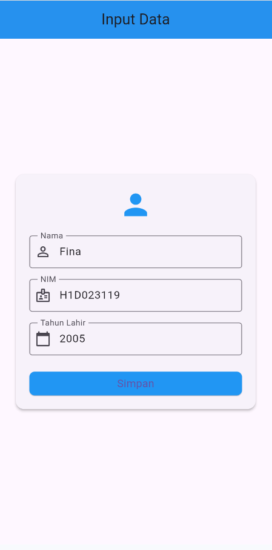
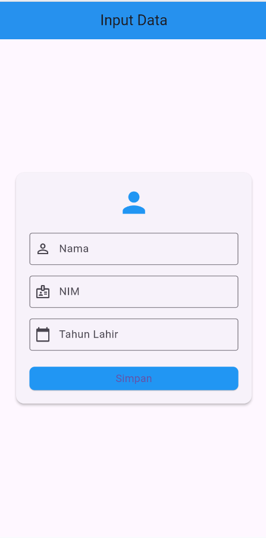
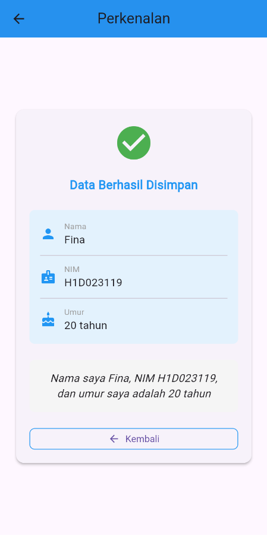

# Aplikasi Input Data Mahasiswa
**Tugas 6 - Pemrograman Mobile**

## Identitas Mahasiswa
- **Nama**: Fina Julianti
- **NIM**: H1D023119
- **Shift**: E
- **Program Studi**: Informatika
- **Universitas**: Universitas Jenderal Soedirman

## Deskripsi Aplikasi
Aplikasi Flutter sederhana untuk menginput dan menampilkan data mahasiswa yang mencakup **Nama**, **NIM**, dan **Tahun Lahir**. Aplikasi ini mendemonstrasikan konsep passing data antar halaman menggunakan `Navigator` dan `Constructor`.

## Screenshot Aplikasi

### Halaman Form Input
<p align="center">
  
  <br>
  <em>Form input untuk memasukkan Nama, NIM, dan Tahun Lahir</em>
</p>

### Halaman Form Input (Kosong)
<p align="center">
  
  <br>
  <em>Tampilan awal form sebelum diisi</em>
</p>

### Halaman Hasil/Perkenalan
<p align="center">
  
  <br>
  <em>Hasil tampilan data yang telah diinput beserta perhitungan umur</em>
</p>

---

## Penjelasan Passing Data dari Form ke Halaman Tampilan

Pada project ini dibuat dua layar di folder `lib/ui`:
- **`form_data.dart`** — Layar form input yang berisi field Nama, NIM, dan Tahun Lahir
- **`tampil_data.dart`** — Layar untuk menampilkan hasil input (perkenalan singkat)

### Alur Passing Data:

1. **User mengisi form** di `FormDataScreen`
2. **Data diambil** dari `TextEditingController` pada setiap field
3. **Navigator.push** digunakan untuk membuka layar hasil (`TampilData`)
4. **Data dikirim** melalui parameter constructor widget `TampilData`

### 1. Pengambilan Data dari Form Input

Di file `ui/form_data.dart`, data dikumpulkan menggunakan `TextEditingController`:

```dart
final TextEditingController _namaController = TextEditingController();
final TextEditingController _nimController = TextEditingController();
final TextEditingController _tahunController = TextEditingController();
```

### 2. Pengiriman Data Menggunakan Navigator

Ketika user menekan tombol **"Simpan"**, data dikirim ke halaman tampilan:

```dart
String nama = _namaController.text;
String nim = _nimController.text;
int tahun = int.parse(_tahunController.text);

Navigator.of(context).push(
  MaterialPageRoute(
    builder: (context) => TampilData(
      nama: nama,
      nim: nim,
      tahun: tahun,
    ),
  ),
);
```

### 3. Penerimaan Data di Halaman Hasil

Di file `ui/tampil_data.dart`, data diterima melalui constructor:

```dart
class TampilData extends StatelessWidget {
  final String nama;
  final String nim;
  final int tahun;

  const TampilData({
    Key? key,
    required this.nama,
    required this.nim,
    required this.tahun,
  }) : super(key: key);

  @override
  Widget build(BuildContext context) {
    final int umur = DateTime.now().year - tahun;
    // Tampilkan data: nama, nim, umur
  }
}
```

### Keuntungan Metode Ini:
- ✅ **Sederhana dan langsung** - Data dikirim tanpa perlu global state
- ✅ **Type-safe** - Tipe data jelas melalui parameter required
- ✅ **Mudah di-debug** - Alur data terlihat eksplisit

---

## Cara Menjalankan

Jalankan seperti project Flutter biasa:

```powershell
flutter pub get

class TampilData extends StatelessWidget {flutter run

  final String nama;```

  final String nim;
  final int tahun;

  const TampilData({
    super.key,
    required this.nama,
    required this.nim,
    required this.tahun,
  });
```

Kata kunci `required` memastikan bahwa ketiga data tersebut wajib dikirimkan saat membuat instance widget `TampilData`.

### 4. Menampilkan dan Memproses Data
Data yang diterima kemudian digunakan untuk ditampilkan di UI dan melakukan kalkulasi sederhana (menghitung umur):

```dart
final int umur = DateTime.now().year - tahun;
```

---

## Alur Lengkap Passing Data

```
FormData (form_data.dart)
    ↓
[User mengisi form Nama, NIM, Tahun Lahir]
    ↓
[User menekan tombol "Simpan"]
    ↓
[Data diambil dari TextEditingController]
    ↓
[Navigator.push mengirim data ke TampilData]
    ↓
TampilData (tampil_data.dart)
    ↓
[Data diterima melalui constructor]
    ↓
[Data ditampilkan di UI dalam bentuk paragraf perkenalan]
```

---

## Struktur Direktori

```
lib/
├── main.dart           # Entry point aplikasi
└── ui/
    ├── form_data.dart  # Halaman form input data mahasiswa
    └── tampil_data.dart # Halaman hasil tampilan data
```

---

## Cara Menjalankan

```powershell
flutter pub get
flutter run -d chrome
```

## Struktur Direktori

```
lib/
├── main.dart           # Entry point aplikasi
└── ui/
    ├── form_data.dart  # Halaman form input data mahasiswa
    └── tampil_data.dart # Halaman hasil tampilan data
screenshots/
├── form_input.png      # Screenshot form terisi
├── form_empty.png      # Screenshot form kosong
└── tampil_data.png     # Screenshot halaman hasil
```

---

## Teknologi yang Digunakan
- **Flutter SDK** v3.35.7
- **Dart** v3.9.2
- **Material Design** untuk UI/UX

## Fitur
- ✨ Input data mahasiswa (Nama, NIM, Tahun Lahir)
- 🧮 Perhitungan otomatis umur berdasarkan tahun lahir
- 📱 UI responsif dengan desain modern dan clean
- 🎨 Material Design dengan Card, Icons, dan styling yang konsisten

---

**© 2024 - Fina Julianti (H1D023119)**
## Screenshot Aplikasi

### 1. Halaman Form Input
Halaman ini menampilkan form dengan field:
- **Nama**
- **NIM**
- **Tahun Lahir**
- Tombol **Simpan**

### 2. Halaman Form Terisi
Contoh data yang diinput:
- Nama: Fina Julianti
- NIM: H1D023119
- Tahun Lahir: 2004

### 3. Halaman Perkenalan
Menampilkan output dalam bentuk paragraf:

> "Nama saya Fina Julianti, NIM H1D023119, dan umur saya adalah 21 tahun"
